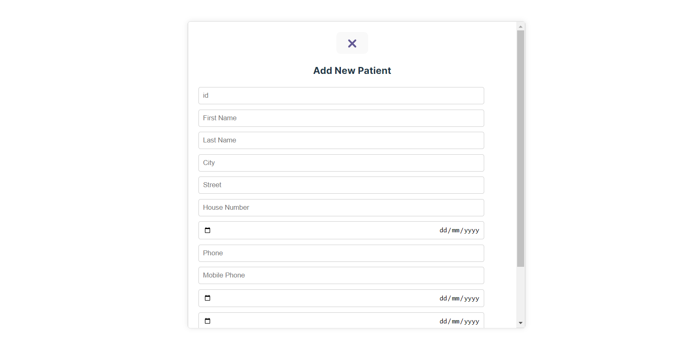
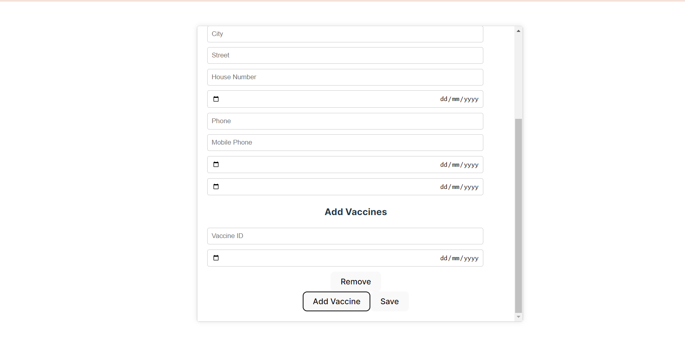
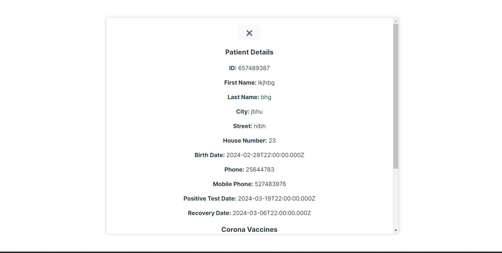
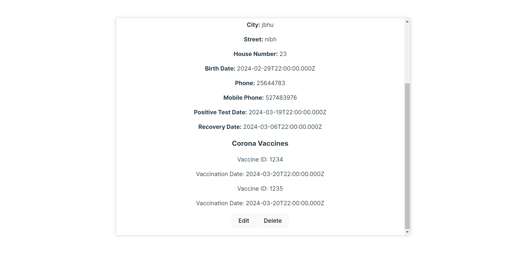
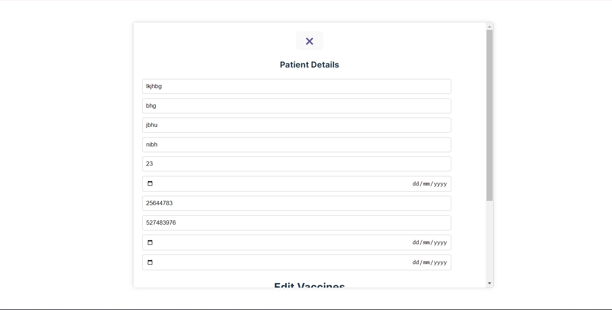
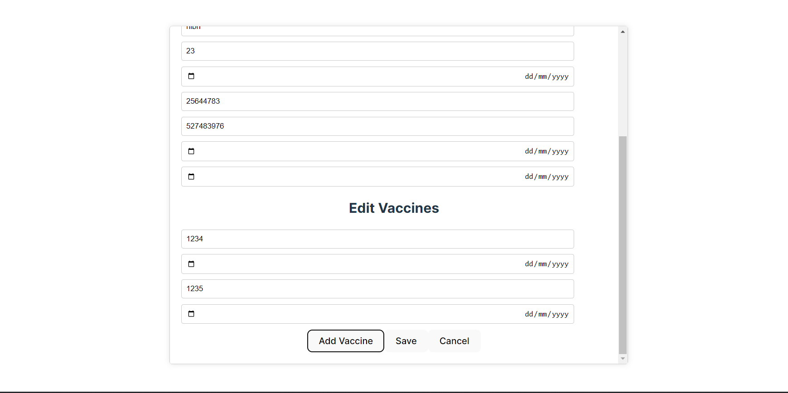
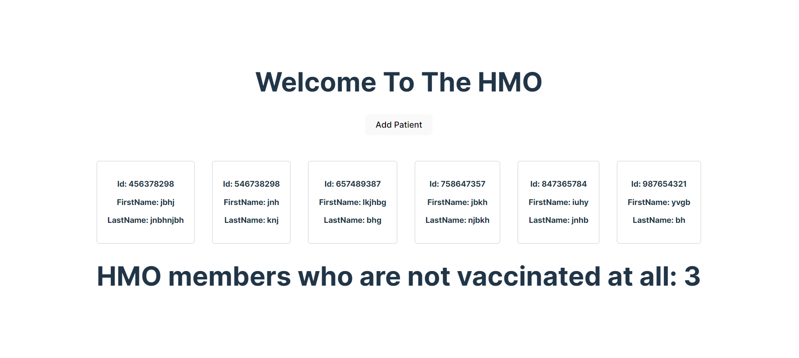

# TzviaShachar_Hadasim4.0
home test Hadasim
תרגיל בית הדסים

צביה שחר

המאגר מחולק באופן הבא:
תרגיל 1:

•חלק א- מימוש השרת-תיקיית server: המכילה את כל קבצי הקוד של השרת.
כדי להריץ את השרת צריך להריץ את הקובץ הראשי בתיקיית השרת הנקרא: server.js על ידי הפקודה: node server.js
לצורך פעולה טובה של השרת יש להוריד את הספריות הבאות: express, body-parser, cors, mysql

חלק ב'- תיקיית client-side המכילה את הפרויקט בREACT של צד הלקוח.
כדי להריץ את התוכנית צריך להריץ את הקובץ הראשי הנקרא: App.jsx בטרמינל על ידי הפקודה npm run dev.
במקרה שהתוכנית לא רצה על הכתובת הזאת:http://localhost:5173 יש לשנות בקובץ השרת הראשי server.js בשורות הקוד האלו:
app.use (cors ({
    origin: 'http://localhost:5173', 
    methods: ['GET', 'POST', 'PUT', 'DELETE', 'PATCH', 'HEAD', 'OPTIONS'],
    allowedHeaders: ['Content-Type', 'Origin', 'X-Requested-With', 'Accept', 'x-client-key', 'x-client-token', 'x-client-secret', 'Authorization'],
    credentials: true}))
    במקום ה origin את הקישור המתאים כדי לאפשר גישה.
    הנחות בבניית צד לקוח: 
    *חיסון שהוכנס ללקוח לא יכול להשתנות או להימחק (מסיבות הגיון: אדם לא יכול אחרי שעשה חיסון להחליט שהוא לא עשה חיסון וכו').
    *אפשרות של הוספת חיסון ללקוח רק על חיסון שקיים כבר במערכת אם החיסון לא קיים במערכת תיווצר שגיאה. החיסונים הקיימים במערכת: ID:1234, ID:1235.
    *בדיקות ולידציה בצד שרת.
    
חלק ג- קובץ PDF של מפרט ארכיטקטוני של המערכת.

תרגיל 2- פרויקט קונסול בCֳ# בשם exe2_hadasim פתרון בעיית מגדלי טוויטר

תרגיל 3- קובץ WORD שנקרא מטלה3 שמכיל את התשובה.

צילומי מסך של צד הלקוח במטלה 1:

